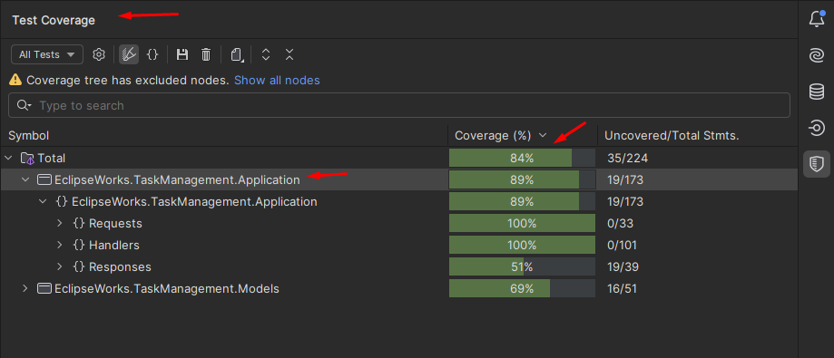
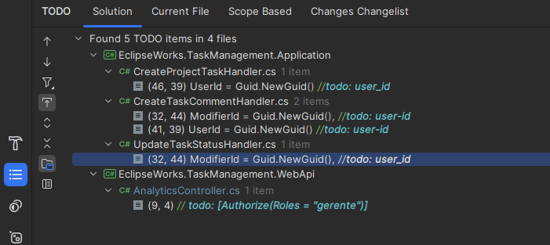

# EclipseWorks

## English 🇺🇸

# Technical Documentation - EclipseWorks Project

## Project Overview

The **EclipseWorks** system is developed using modern technologies like **ASP.NET Core** and **MongoDb**.
The database can be configured and run in a container using **Docker Compose**.
This document describes the steps necessary to configure, run, and understand this project.
---

## Prerequisites

Before starting, make sure the following tools are installed on your machine:

1. [.NET 8.0 SDK](https://dotnet.microsoft.com/download)
2. [Docker](https://www.docker.com/products/docker-desktop/)
3. [Docker Compose](https://docs.docker.com/compose/)

---

## Project Structure

The project has the following directory structure:

```
/EclipseWorks
│
├── .gitignore                    # Git exclusion file
├── docker-compose.yaml           # Docker Compose configuration
├── Dockerfile                    # Basic Docker configuration
├── README.md                     # Project's main documentation
├── EclipseWorks.TaskManagement.sln # Project solution file
│
├── /src
│   ├── /EclipseWorks.TaskManagement.Application  # Application layer (handlers, requests, responses)
│   ├── /EclipseWorks.TaskManagement.Infrastructure # Infrastructure and application configuration
│   ├── /EclipseWorks.TaskManagement.Models       # Models and data contracts
│   └── /EclipseWorks.TaskManagement.WebApi       # Main API (controllers and configuration)
│
├── /tests
│   └── /EclipseWorks.TaskManagement.Tests        # Tests
│
```

---

## Setting Up the Environment

To set up the environment, follow the steps below:

1. Clone the repository to your local machine:
   ```bash
   git clone https://github.com/mikerozendo/EclipseWorks.TaskManagement.git
   cd EclipseWorks
   ```
2. Make sure **Docker Desktop** is running and Docker Compose support is enabled.
3. In the root directory, run the following command to start the containers:
   ```bash
   docker-compose up -d
   ```
4. Check if the API is available by accessing `http://localhost:8080/swagger/index.html` in your browser.

---

## Running Tests

To ensure all functionalities are working correctly, run the automated tests:

1. In the root directory, navigate to the tests project:
   ```bash
   cd src/EclipseWorks.Tests
   ```
2. Run the tests with the following command:
   ```bash
   dotnet test
   ```

The test results will be displayed in the terminal.
---

## Test Coverage
The project currently has 89% test coverage in the Application layer, as it is where all requests are processed and business rules are validated.


---

## Contributing to the Project

If you wish to contribute to **EclipseWorks**, follow these steps:

1. Create a fork of the repository to your personal account.
2. Make your changes in a new branch, using naming conventions like `feature/<FEATURE_NAME>` or
   `bugfix/<FIX_DESCRIPTION>`.
3. Ensure to run all tests before submitting your contribution.
4. Submit a pull request detailing the changes made.

---

## Contact Us

If you have any questions or encounter any issues, contact us through:

- Email: mikerozendo@gmail.com
- GitHub Issues: [EclipseWorks Issues Page](https://github.com/mikerozendo/EclipseWorks.TaskManagement/issues)

---

### Technical Decisions

- **ASP.NET Core Usage**: Chosen for its high performance and native integration with other tools in the .NET ecosystem.
- **MongoDB as Database**: Chosen due to its flexibility and the requirement for historical data creation as part of the
  test.
- **Containerization with Docker**: Used for consistency in the development and deployment environment.
- **Docker Compose**: Chosen for its ease of handling multiple containers and enabling work between the API and
  Database.
- [MediatR](https://github.com/jbogard/MediatR): Used to facilitate the implementation of the Mediator pattern, also
  chosen for its simplicity in building an application.

### Technical Debts

- **Application Monitoring**: Lacks a robust solution for monitoring in production, such as integration with
  observability tools.
- **User IDs**: Needs a better auth solution to determine how the application will recognize a user's ID. Parts
  depending on a `user_id` are marked as TD.
- **Analytics**: The test specified that the query returning closed task statistics should only allow manager access,
  but this was also marked as TD.

  

---

## Português 🇧🇷

# Documento Técnico - Projeto EclipseWorks

## Visão Geral do Projeto

O **EclipseWorks** é um sistema desenvolvido utilizando tecnologias modernas como **ASP.NET Core** e **MongoDb**. 
O banco de dados utilizado pode ser configurado e executado em um container utilizando **Docker Compose**.

Este documento descreve os passos necessários para configurar, rodar e entender esse projeto.

---

## Pré-Requisitos

Antes de iniciar, certifique-se de que as seguintes ferramentas estejam instaladas em sua máquina:

1. [.NET 8.0 SDK](https://dotnet.microsoft.com/download)
2. [Docker](https://www.docker.com/products/docker-desktop/)
3. [Docker Compose](https://docs.docker.com/compose/)

---

## Estrutura do Projeto

O projeto possui a seguinte estrutura de diretórios:

```
/EclipseWorks
│
├── .gitignore                    # Arquivo de exclusão do git
├── docker-compose.yaml           # Configuração Docker Compose
├── Dockerfile                    # Configuração básica do Docker
├── README.md                     # Documentação principal do projeto
├── EclipseWorks.TaskManagement.sln # Arquivo de solução do projeto
│
├── /src
│   ├── /EclipseWorks.TaskManagement.Application  # Camada de aplicação (handlers, requests, responses)
│   ├── /EclipseWorks.TaskManagement.Infrastructure # Infraestrutura e configuração da aplicação
│   ├── /EclipseWorks.TaskManagement.Models       # Modelos e contratos de dados
│   └── /EclipseWorks.TaskManagement.WebApi       # API principal (controllers e configuração)
│
├── /tests
│   └── /EclipseWorks.TaskManagement.Tests        # Testes
│

```
---

## Configurando o Ambiente

Para configurar o ambiente, siga os passos abaixo:

1. Clone o repositório para sua máquina local:
   ```bash
   git clone https://github.com/mikerozendo/EclipseWorks.TaskManagement.git
   cd EclipseWorks
   ```
2. Certifique-se de que o **Docker Desktop** está em execução e com o suporte ao Docker Compose habilitado.
3. No diretório raiz, execute o seguinte comando para iniciar os containers:
   ```bash
   docker-compose up -d
   ```
4. Verifique se a API está disponível acessando `http://localhost:8080/swagger/index.html` em seu navegador.

---

## Executando os Testes

Para garantir que todas as funcionalidades estão funcionando corretamente, execute os testes automatizados:

1. No diretório raiz, vá para o projeto de testes:
   ```bash
   cd src/EclipseWorks.Tests
   ```
2. Execute os testes com o seguinte comando:
   ```bash
   dotnet test
   ```

Os resultados dos testes serão exibidos no terminal.
---

## Cobertura de Testes
O projeto atualmente tem 89% de cobertura de testes na camada de Application, uma vez que é na mesma que todos os requests são processados e as regras de negócio são validadas.


---
## Contribuindo para o Projeto

Se você deseja contribuir com o **EclipseWorks**, siga os passos abaixo:

1. Crie um fork do repositório para sua conta pessoal.
2. Faça suas alterações em uma nova branch, utilizando uma convenção de nomes como `feature/<NOME_DA_FEATURE>` ou
   `bugfix/<DESCRICAO_DO_FIX>`.
3. Certifique-se de executar todos os testes antes de enviar sua contribuição.
4. Envie um pull request detalhando as alterações realizadas.

---

## Fale Conosco

Caso tenha dúvidas ou encontre algum problema, entre em contato através de:

- Email: mikerozendo@gmail.com
- GitHub Issues: [EclipseWorks Issues Page](https://github.com/mikerozendo/EclipseWorks.TaskManagement/issues)

---

### Decisões Técnicas

- **Uso do ASP.NET Core**: Escolhido por sua alta performance e integração nativa com outras ferramentas do ecossistema
  .NET.
- **MongoDB como Banco de Dados**: Decidi pelo MongoDb devido à sua flexibilidade e também pelo fato do teste pedir a criação de dados do tipo históricos.
- **Containerização com Docker**: Utilizado para consistência no ambiente de desenvolvimento e implantação.
- **Docker Compose**: Utilizado pela facilidade em lidar com mais de um container e conseguir trabalhar com a Api e o Db.
- [MediatR](https://github.com/jbogard/MediatR): Utilizado para facilitar a implementação do padrão Mediator, optei pelo mesmo também pela sua facilidade de construir uma aplicação.

### Dívidas Técnicas

- **Monitoramento da Aplicação**: Falta uma solução robusta para monitoramento em produção, como
  integração com ferramentas de observabilidade.

- **Id's de usuário**: Precisa refinar melhor qual a solução de Auth para que seja feito um levantamento de como a aplicação iria saber o Id de um usuário, as partes que dependem de um user_id foram marcadas como TD

- **Analytics**: No teste foi solicitado que a consulta que retornaria as estatísticas de tasks fechadas tivesse o acesso liberado sómente ao gerente, porém ficou marcado como TD também

  